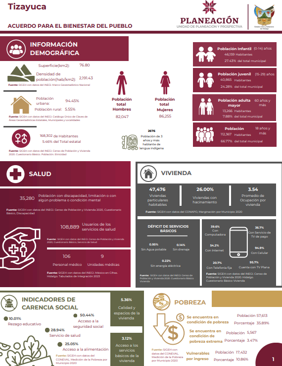
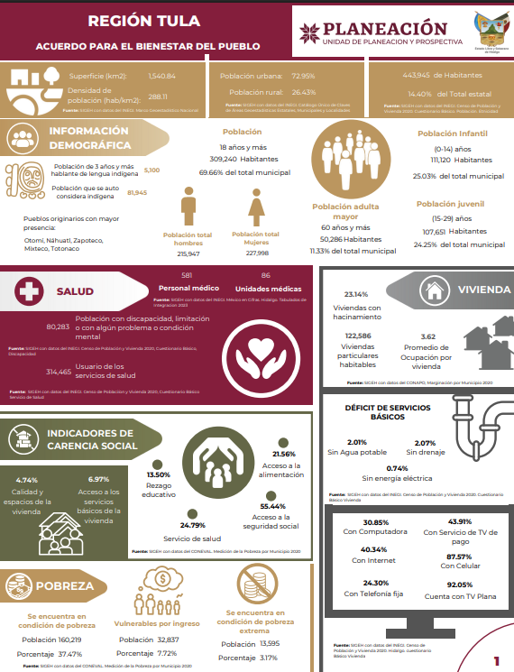
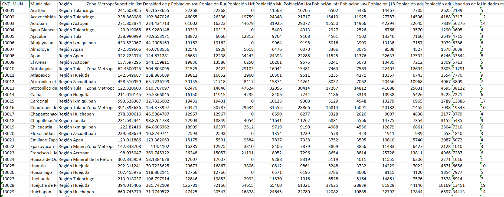

## Descripción general

Mi mala organización en el pasado(mi yo del servicio social) y el uso de código poco eficiente me llevaron a esta situación. Ahora necesito crear una documentación clara y funcional que me permita actualizar las infografías de manera rápida y efectiva.

Las infografías que se actualizarán son las siguientes:

-   Municipal

-   Regional

-   Metropolitana

-   Estatal

Las infografias se ven algo asi:

{fig-align="center"}

{fig-align="center"}

## Nivel Municipal

La construcción de la base de datos para estas infografías depende completamente de la base de datos municipal, ya que a partir de ella se generan todas las demás. Por ello, se realizará una nueva estructuración tomando como referencia las infografías elaboradas anteriormente. Principalmente, estas se dividirán en 21 apartados, los cuales son:

1.  Información Demografica

2.  Salud

3.  Vivienda

4.  Carencias

5.  Pobreza

6.  Seguridad

7.  Procedimientos Administrativos

8.  Justicia

9.  Incidencia Delictiva

10. Tratamiento de Aguas Residuales

11. Red Carreteta

12. Areas Protegidas

13. Medio Ambiente

14. Movilidad

15. Educación

16. Comercio

17. Economia

18. Turismo

19. Cultura

20. Producción Ganadera

21. Lengua Indigena

### Estructuración

Usamos un archivo de Excel llamado **“referencias”**, donde están todos los enlaces de las fuentes de las variables de interés.

En la carpeta **códigos** del repositorio hay un archivo de R para cada sección. Cada uno se encarga de limpiar los archivos descargados y obtener la variable que necesitamos. No entraremos en el detalle de cómo se hace esa limpieza.

Lo importante es que, al final de cada script de R, se genera un archivo de Excel con el nombre de la sección y sus variables de interés.

***Nota importante:***

Si necesitas limpiar un archivo, la estructura debe guardarse comenzando con la columna **CVE_MUN**, seguida de las variables. Esto es necesario porque después se hará un *merge* automático en el script de R llamado *0.Juntar para base.R*. Ese problema de estructura se corrige en el código *00.Corrección de columna de municipios.R*

### Base de datos

La base de datos se construirá uniendo todas las bases de cada sección mediante el código **0.Juntar para base.R**.\

El archivo final se llamará **Infografia_Base_Municipal_Sin_Operaciones_2026_Enero.xlsx** y tendrá la siguiente forma:

{fig-align="center"}

Tiene **639** variables, donde obtendremos distintas columnas haciendo diversas operaciones. Pero para hacer operaciones. primero debemos pasar todas las columnas que corresponden a numerico.

```{r eval=FALSE}
datos = datos |> 
  dplyr::mutate(
    dplyr::across(
      .cols = c(`Superficie (km2)`:`Número de áreas protegidas`, 
                `Cantidad promedio diaria de residuos sólidos urbanos recolectados`:`Grado promedio de escolaridad`,
                `Población de 15 años y más`:`Índice de marginación 2020`,
                `Indice de migracición 2020`,
                `Total Hospedajes`:`Popoluca insuficientemente especificado`), 
      .fns = ~ .x |>  as.numeric()
    )  
  )
```

#### Porcentajes respecto a "Poblacion Total"

Las columnas de interes son:

-   Población Rural

-   Población Urbana

-   Población Mujeres

-   Población Hombres

-   Población infantil (0-14 años)

-   Población juvenil (15-29 años)

-   Población (18 años y más)

-   Población adulta (30-59 años)

-   Población adulta mayor (60 y más años)

```{r eval=FALSE}
datos = datos |> 
  dplyr::mutate(
    dplyr::across(
      .cols = dplyr::any_of(poblacion_total),
      .fns = ~ (.x /`Población total`)*100,
      .names = "{.col}%"
    )
  )
```

Cabe destacar que el proceso genera columnas completamente nuevas siguiendo el patrón de agregar **%** al final del nombre.\
Por ejemplo, a partir de la variable de interés **“Población Rural”**, se crea una nueva columna llamada **“Población Rural%”**. El detalle es que estas nuevas columnas se agregan hasta el final del *data.frame*, y por el momento no se encontró una función que las coloque justo al lado de la columna original.

Por ello, se creó un pequeño código que se encarga de moverlas y dejarlas junto a su columna correspondiente.

```{r eval=FALSE}
for (i in seq_along(poblacion_total)) {
  cat(
    "dplyr::relocate(`",
    paste0(poblacion_total[i], "%"),
    "`, .after = `",
    poblacion_total[i],
    "`) |> \n",
    sep = ""
  )
}
```

Con este codigo unicamente debemos de copiar lo que nos manda imprimir el *`for`*, ejemplo de ello es:

```{r eval=FALSE}
datos = datos |> 
  dplyr::relocate(`Población Rural%`, .after = `Población Rural`) |> 
  dplyr::relocate(`Población Urbana%`, .after = `Población Urbana`) |> 
  dplyr::relocate(`Población Mujeres%`, .after = `Población Mujeres`) |> 
  dplyr::relocate(`Población Hombres%`, .after = `Población Hombres`) |> 
  dplyr::relocate(`Población infantil (0-14 años)%`, .after = `Población infantil (0-14 años)`) |> 
  dplyr::relocate(`Población juvenil (15-29 años)%`, .after = `Población juvenil (15-29 años)`) |> 
  dplyr::relocate(`Población (18 años y más)%`, .after = `Población (18 años y más)`) |> 
  dplyr::relocate(`Población adulta (30-59 años)%`, .after = `Población adulta (30-59 años)`) |> 
  dplyr::relocate(`Población adulta mayor (60 y más años)%`, .after = `Población adulta mayor (60 y más años)`) 
```

#### Porcentajes respecto a "Viviendas particulares habitadas"

Las columnas de interes son:

-   Disponibilidad de bienes y tecnologías de la información y de la comunicación Disponen Refrigerador

-   Disponibilidad de bienes y tecnologías de la información y de la comunicación Disponen Lavadora

-   Disponibilidad de bienes y tecnologías de la información y de la comunicación Disponen Horno de microondas

-   Disponibilidad de bienes y tecnologías de la información y de la comunicación Disponen Automóvil o camioneta

-   Disponibilidad de bienes y tecnologías de la información y de la comunicación Disponen Motocicleta o motoneta

-   Disponibilidad de bienes y tecnologías de la información y de la comunicación Disponen Bicicleta que se utilice como medio de transporte

-   Disponibilidad de bienes y tecnologías de la información y de la comunicación Disponen Algún aparato o dispositivo para oír radio

-   Disponibilidad de bienes y tecnologías de la información y de la comunicación Disponen Televisor

-   Disponibilidad de bienes y tecnologías de la información y de la comunicación Disponen Computadora, laptop o tablet

-   Disponibilidad de bienes y tecnologías de la información y de la comunicación Disponen Línea telefónica fija

-   Disponibilidad de bienes y tecnologías de la información y de la comunicación Disponen Teléfono celular

-   Disponibilidad de bienes y tecnologías de la información y de la comunicación Disponen Internet

-   Disponibilidad de bienes y tecnologías de la información y de la comunicación Disponen Servicio de televisión de paga (Cable o satelital)

-   Disponibilidad de bienes y tecnologías de la información y de la comunicación Disponen Servicio de películas, música o videos de paga por Internet

-   Disponibilidad de bienes y tecnologías de la información y de la comunicación Disponen Consola de videojuegos

-   Disponibilidad de bienes y tecnologías de la información y de la comunicación No disponen Refrigerador

-   Disponibilidad de bienes y tecnologías de la información y de la comunicación No disponen Lavadora

-   Disponibilidad de bienes y tecnologías de la información y de la comunicación No disponen Horno de microondas

-   Disponibilidad de bienes y tecnologías de la información y de la comunicación No disponen Automóvil o camioneta

-   Disponibilidad de bienes y tecnologías de la información y de la comunicación No disponen Motocicleta o motoneta

-   Disponibilidad de bienes y tecnologías de la información y de la comunicación No disponen Bicicleta que se utilice como medio de transporte

-   Disponibilidad de bienes y tecnologías de la información y de la comunicación No disponen Algún aparato o dispositivo para oír radio

-   Disponibilidad de bienes y tecnologías de la información y de la comunicación No disponen Televisor

-   Disponibilidad de bienes y tecnologías de la información y de la comunicación No disponen Computadora, laptop o tablet

-   Disponibilidad de bienes y tecnologías de la información y de la comunicación No disponen Línea telefónica fija

-   Disponibilidad de bienes y tecnologías de la información y de la comunicación No disponen Teléfono celular

-   Disponibilidad de bienes y tecnologías de la información y de la comunicación No disponen Internet

-   Disponibilidad de bienes y tecnologías de la información y de la comunicación No disponen Servicio de televisión de paga (Cable o satelital)

-   Disponibilidad de bienes y tecnologías de la información y de la comunicación No disponen Servicio de películas, música o videos de paga por Internet

-   Disponibilidad de bienes y tecnologías de la información y de la comunicación No disponen Consola de videojuegos

-   Disponibilidad de bienes y tecnologías de la información y de la comunicación No especificado Refrigerador

-   Disponibilidad de bienes y tecnologías de la información y de la comunicación No especificado Lavadora

-   Disponibilidad de bienes y tecnologías de la información y de la comunicación No especificado Horno de microondas

-   Disponibilidad de bienes y tecnologías de la información y de la comunicación No especificado Automóvil o camioneta

-   Disponibilidad de bienes y tecnologías de la información y de la comunicación No especificado Motocicleta o motoneta

-   Disponibilidad de bienes y tecnologías de la información y de la comunicación No especificado Bicicleta que se utilice como medio de transporte

-   Disponibilidad de bienes y tecnologías de la información y de la comunicación No especificado Algún aparato o dispositivo para oír radio

-   Disponibilidad de bienes y tecnologías de la información y de la comunicación No especificado Televisor

-   Disponibilidad de bienes y tecnologías de la información y de la comunicación No especificado Computadora, laptop o tablet

-   Disponibilidad de bienes y tecnologías de la información y de la comunicación No especificado Línea telefónica fija

-   Disponibilidad de bienes y tecnologías de la información y de la comunicación No especificado Teléfono celular

-   Disponibilidad de bienes y tecnologías de la información y de la comunicación No especificado Internet

-   Disponibilidad de bienes y tecnologías de la información y de la comunicación No especificado Servicio de televisión de paga (Cable o satelital)

-   Disponibilidad de bienes y tecnologías de la información y de la comunicación No especificado Servicio de películas, música o videos de paga por Internet

-   Disponibilidad de bienes y tecnologías de la información y de la comunicación No especificado Consola de videojuegos

```{r eval=FALSE}
datos = datos |> 
  dplyr::mutate(
    dplyr::across(
      .cols = dplyr::any_of(viviendas_particulares),
      .fns = ~ (.x /`Viviendas particulares habitadas`)*100,
      .names = "{.col}%"
    )
  )
```

Mismo razonamiento que el anterior para recolocar las columnas.

```{r eval=FALSE}
for (i in seq_along(viviendas_particulares)) {
  cat(
    "dplyr::relocate(`",
    paste0(viviendas_particulares[i], "%"),
    "`, .after = `",
    viviendas_particulares[i],
    "`) |> \n",
    sep = ""
  )
}


datos = datos |> 
  dplyr::relocate(`Disponibilidad de bienes y tecnologías de la información y de la comunicación Disponen Refrigerador%`, .after = `Disponibilidad de bienes y tecnologías de la información y de la comunicación Disponen Refrigerador`) |> 
  dplyr::relocate(`Disponibilidad de bienes y tecnologías de la información y de la comunicación Disponen Lavadora%`, .after = `Disponibilidad de bienes y tecnologías de la información y de la comunicación Disponen Lavadora`) |> 
  dplyr::relocate(`Disponibilidad de bienes y tecnologías de la información y de la comunicación Disponen Horno de microondas%`, .after = `Disponibilidad de bienes y tecnologías de la información y de la comunicación Disponen Horno de microondas`) |> 
  dplyr::relocate(`Disponibilidad de bienes y tecnologías de la información y de la comunicación Disponen Automóvil o camioneta%`, .after = `Disponibilidad de bienes y tecnologías de la información y de la comunicación Disponen Automóvil o camioneta`) |> 
  dplyr::relocate(`Disponibilidad de bienes y tecnologías de la información y de la comunicación Disponen Motocicleta o motoneta%`, .after = `Disponibilidad de bienes y tecnologías de la información y de la comunicación Disponen Motocicleta o motoneta`) |> 
  dplyr::relocate(`Disponibilidad de bienes y tecnologías de la información y de la comunicación Disponen Bicicleta que se utilice como medio de transporte%`, .after = `Disponibilidad de bienes y tecnologías de la información y de la comunicación Disponen Bicicleta que se utilice como medio de transporte`) |> 
  dplyr::relocate(`Disponibilidad de bienes y tecnologías de la información y de la comunicación Disponen Algún aparato o dispositivo para oír radio%`, .after = `Disponibilidad de bienes y tecnologías de la información y de la comunicación Disponen Algún aparato o dispositivo para oír radio`) |> 
  dplyr::relocate(`Disponibilidad de bienes y tecnologías de la información y de la comunicación Disponen Televisor%`, .after = `Disponibilidad de bienes y tecnologías de la información y de la comunicación Disponen Televisor`) |> 
  dplyr::relocate(`Disponibilidad de bienes y tecnologías de la información y de la comunicación Disponen Computadora, laptop o tablet%`, .after = `Disponibilidad de bienes y tecnologías de la información y de la comunicación Disponen Computadora, laptop o tablet`) |> 
  dplyr::relocate(`Disponibilidad de bienes y tecnologías de la información y de la comunicación Disponen Línea telefónica fija%`, .after = `Disponibilidad de bienes y tecnologías de la información y de la comunicación Disponen Línea telefónica fija`) |> 
  dplyr::relocate(`Disponibilidad de bienes y tecnologías de la información y de la comunicación Disponen Teléfono celular%`, .after = `Disponibilidad de bienes y tecnologías de la información y de la comunicación Disponen Teléfono celular`) |> 
  dplyr::relocate(`Disponibilidad de bienes y tecnologías de la información y de la comunicación Disponen Internet%`, .after = `Disponibilidad de bienes y tecnologías de la información y de la comunicación Disponen Internet`) |> 
  dplyr::relocate(`Disponibilidad de bienes y tecnologías de la información y de la comunicación Disponen Servicio de televisión de paga (Cable o satelital)%`, .after = `Disponibilidad de bienes y tecnologías de la información y de la comunicación Disponen Servicio de televisión de paga (Cable o satelital)`) |> 
  dplyr::relocate(`Disponibilidad de bienes y tecnologías de la información y de la comunicación Disponen Servicio de películas, música o videos de paga por Internet%`, .after = `Disponibilidad de bienes y tecnologías de la información y de la comunicación Disponen Servicio de películas, música o videos de paga por Internet`) |> 
  dplyr::relocate(`Disponibilidad de bienes y tecnologías de la información y de la comunicación Disponen Consola de videojuegos%`, .after = `Disponibilidad de bienes y tecnologías de la información y de la comunicación Disponen Consola de videojuegos`) |> 
  dplyr::relocate(`Disponibilidad de bienes y tecnologías de la información y de la comunicación No disponen Refrigerador%`, .after = `Disponibilidad de bienes y tecnologías de la información y de la comunicación No disponen Refrigerador`) |> 
  dplyr::relocate(`Disponibilidad de bienes y tecnologías de la información y de la comunicación No disponen Lavadora%`, .after = `Disponibilidad de bienes y tecnologías de la información y de la comunicación No disponen Lavadora`) |> 
  dplyr::relocate(`Disponibilidad de bienes y tecnologías de la información y de la comunicación No disponen Horno de microondas%`, .after = `Disponibilidad de bienes y tecnologías de la información y de la comunicación No disponen Horno de microondas`) |> 
  dplyr::relocate(`Disponibilidad de bienes y tecnologías de la información y de la comunicación No disponen Automóvil o camioneta%`, .after = `Disponibilidad de bienes y tecnologías de la información y de la comunicación No disponen Automóvil o camioneta`) |> 
  dplyr::relocate(`Disponibilidad de bienes y tecnologías de la información y de la comunicación No disponen Motocicleta o motoneta%`, .after = `Disponibilidad de bienes y tecnologías de la información y de la comunicación No disponen Motocicleta o motoneta`) |> 
  dplyr::relocate(`Disponibilidad de bienes y tecnologías de la información y de la comunicación No disponen Bicicleta que se utilice como medio de transporte%`, .after = `Disponibilidad de bienes y tecnologías de la información y de la comunicación No disponen Bicicleta que se utilice como medio de transporte`) |> 
  dplyr::relocate(`Disponibilidad de bienes y tecnologías de la información y de la comunicación No disponen Algún aparato o dispositivo para oír radio%`, .after = `Disponibilidad de bienes y tecnologías de la información y de la comunicación No disponen Algún aparato o dispositivo para oír radio`) |> 
  dplyr::relocate(`Disponibilidad de bienes y tecnologías de la información y de la comunicación No disponen Televisor%`, .after = `Disponibilidad de bienes y tecnologías de la información y de la comunicación No disponen Televisor`) |> 
  dplyr::relocate(`Disponibilidad de bienes y tecnologías de la información y de la comunicación No disponen Computadora, laptop o tablet%`, .after = `Disponibilidad de bienes y tecnologías de la información y de la comunicación No disponen Computadora, laptop o tablet`) |> 
  dplyr::relocate(`Disponibilidad de bienes y tecnologías de la información y de la comunicación No disponen Línea telefónica fija%`, .after = `Disponibilidad de bienes y tecnologías de la información y de la comunicación No disponen Línea telefónica fija`) |> 
  dplyr::relocate(`Disponibilidad de bienes y tecnologías de la información y de la comunicación No disponen Teléfono celular%`, .after = `Disponibilidad de bienes y tecnologías de la información y de la comunicación No disponen Teléfono celular`) |> 
  dplyr::relocate(`Disponibilidad de bienes y tecnologías de la información y de la comunicación No disponen Internet%`, .after = `Disponibilidad de bienes y tecnologías de la información y de la comunicación No disponen Internet`) |> 
  dplyr::relocate(`Disponibilidad de bienes y tecnologías de la información y de la comunicación No disponen Servicio de televisión de paga (Cable o satelital)%`, .after = `Disponibilidad de bienes y tecnologías de la información y de la comunicación No disponen Servicio de televisión de paga (Cable o satelital)`) |> 
  dplyr::relocate(`Disponibilidad de bienes y tecnologías de la información y de la comunicación No disponen Servicio de películas, música o videos de paga por Internet%`, .after = `Disponibilidad de bienes y tecnologías de la información y de la comunicación No disponen Servicio de películas, música o videos de paga por Internet`) |> 
  dplyr::relocate(`Disponibilidad de bienes y tecnologías de la información y de la comunicación No disponen Consola de videojuegos%`, .after = `Disponibilidad de bienes y tecnologías de la información y de la comunicación No disponen Consola de videojuegos`) |> 
  dplyr::relocate(`Disponibilidad de bienes y tecnologías de la información y de la comunicación No especificado Refrigerador%`, .after = `Disponibilidad de bienes y tecnologías de la información y de la comunicación No especificado Refrigerador`) |> 
  dplyr::relocate(`Disponibilidad de bienes y tecnologías de la información y de la comunicación No especificado Lavadora%`, .after = `Disponibilidad de bienes y tecnologías de la información y de la comunicación No especificado Lavadora`) |> 
  dplyr::relocate(`Disponibilidad de bienes y tecnologías de la información y de la comunicación No especificado Horno de microondas%`, .after = `Disponibilidad de bienes y tecnologías de la información y de la comunicación No especificado Horno de microondas`) |> 
  dplyr::relocate(`Disponibilidad de bienes y tecnologías de la información y de la comunicación No especificado Automóvil o camioneta%`, .after = `Disponibilidad de bienes y tecnologías de la información y de la comunicación No especificado Automóvil o camioneta`) |> 
  dplyr::relocate(`Disponibilidad de bienes y tecnologías de la información y de la comunicación No especificado Motocicleta o motoneta%`, .after = `Disponibilidad de bienes y tecnologías de la información y de la comunicación No especificado Motocicleta o motoneta`) |> 
  dplyr::relocate(`Disponibilidad de bienes y tecnologías de la información y de la comunicación No especificado Bicicleta que se utilice como medio de transporte%`, .after = `Disponibilidad de bienes y tecnologías de la información y de la comunicación No especificado Bicicleta que se utilice como medio de transporte`) |> 
  dplyr::relocate(`Disponibilidad de bienes y tecnologías de la información y de la comunicación No especificado Algún aparato o dispositivo para oír radio%`, .after = `Disponibilidad de bienes y tecnologías de la información y de la comunicación No especificado Algún aparato o dispositivo para oír radio`) |> 
  dplyr::relocate(`Disponibilidad de bienes y tecnologías de la información y de la comunicación No especificado Televisor%`, .after = `Disponibilidad de bienes y tecnologías de la información y de la comunicación No especificado Televisor`) |> 
  dplyr::relocate(`Disponibilidad de bienes y tecnologías de la información y de la comunicación No especificado Computadora, laptop o tablet%`, .after = `Disponibilidad de bienes y tecnologías de la información y de la comunicación No especificado Computadora, laptop o tablet`) |> 
  dplyr::relocate(`Disponibilidad de bienes y tecnologías de la información y de la comunicación No especificado Línea telefónica fija%`, .after = `Disponibilidad de bienes y tecnologías de la información y de la comunicación No especificado Línea telefónica fija`) |> 
  dplyr::relocate(`Disponibilidad de bienes y tecnologías de la información y de la comunicación No especificado Teléfono celular%`, .after = `Disponibilidad de bienes y tecnologías de la información y de la comunicación No especificado Teléfono celular`) |> 
  dplyr::relocate(`Disponibilidad de bienes y tecnologías de la información y de la comunicación No especificado Internet%`, .after = `Disponibilidad de bienes y tecnologías de la información y de la comunicación No especificado Internet`) |> 
  dplyr::relocate(`Disponibilidad de bienes y tecnologías de la información y de la comunicación No especificado Servicio de televisión de paga (Cable o satelital)%`, .after = `Disponibilidad de bienes y tecnologías de la información y de la comunicación No especificado Servicio de televisión de paga (Cable o satelital)`) |> 
  dplyr::relocate(`Disponibilidad de bienes y tecnologías de la información y de la comunicación No especificado Servicio de películas, música o videos de paga por Internet%`, .after = `Disponibilidad de bienes y tecnologías de la información y de la comunicación No especificado Servicio de películas, música o videos de paga por Internet`) |> 
  dplyr::relocate(`Disponibilidad de bienes y tecnologías de la información y de la comunicación No especificado Consola de videojuegos%`, .after = `Disponibilidad de bienes y tecnologías de la información y de la comunicación No especificado Consola de videojuegos`)
```

#### Porcentajes respecto a "Población de 15 años y más"

Las columnas de interes son:

-   Poblacion Analfabeta

```{r eval=FALSE}
datos = datos |> 
  dplyr::mutate(
    `Poblacion Analfabeta%` = (`Poblacion Analfabeta`/`Población de 15 años y más`)*100
  ) |> 
  dplyr::relocate(`Poblacion Analfabeta%`, .after = `Poblacion Analfabeta`)
```

#### Porcentajes respecto a "Población económicamente activa Ocupada Total"

Las columnas de interes son:

-   Población económicamente activa Ocupada Hombres

-   Población económicamente activa Ocupada Mujeres

```{r eval=FALSE}
datos = datos |> 
  dplyr::mutate(
    dplyr::across(
      .cols = dplyr::any_of(ocupada_total),
      .fns = ~ (.x /`Población económicamente activa Ocupada Total`)*100,
      .names = "{.col}%"
    )
  )


for (i in seq_along(ocupada_total)) {
  cat(
    "dplyr::relocate(`",
    paste0(ocupada_total[i], "%"),
    "`, .after = `",
    ocupada_total[i],
    "`) |> \n",
    sep = ""
  )
}


datos = datos |> 
  dplyr::relocate(`Población económicamente activa Ocupada Hombres%`, .after = `Población económicamente activa Ocupada Hombres`) |> 
  dplyr::relocate(`Población económicamente activa Ocupada Mujeres%`, .after = `Población económicamente activa Ocupada Mujeres`) 
```

#### Porcentajes respecto a "Población total Estatal"

Las columnas de interes son:

-   Población total

```{r eval=FALSE}
datos = datos |> 
  dplyr::mutate(
    `Población total%` = (`Población total`/sum(`Población total`, na.rm = T))*100
  ) |> 
  dplyr::relocate(`Población total%`, .after = `Población total`)
```

#### Porcentajes respecto a "Ingreso por remesas"

Las columnas de interes son:

-   Ingresos por remesas Enero-Septiembre(2025)

```{r eval=FALSE}
datos = datos |> 
  dplyr::mutate(
    `Ingresos por remesas Enero-Septiembre(2025)%` = (`Ingresos por remesas Enero-Septiembre(2025)`/ sum(`Ingresos por remesas Enero-Septiembre(2025)`, na.rm = T))*100
  ) |> 
  dplyr::relocate(`Ingresos por remesas Enero-Septiembre(2025)%`, .after = `Ingresos por remesas Enero-Septiembre(2025)`)
```

De esta manera nos queda en total **698** columnas.

## Nivel Regional

Vamos a utilizar como base el archivo **Infografia_Base_Municipal_Sin_Operaciones_2026_Enero.xlsx,** la idea es generar esa misma base pero agrupados a nivel regional, pero algunas variables existen detalles que debemos hacer operaciones previas.

Para esto vamos a guardar todas los nombres de las columnas:

```{r eval=FALSE}
columnas_iniciales = names(datos)
```

Comenzamos con lo mismo, pasando a numerico todas las variables necesarias y renombrando correctamente algunas:

```{r eval=FALSE}
datos = datos |> 
  dplyr::rename(
    `Trabajadores del sector Terciario(Servicios)%` = `Trabajadores del sector Terciario(Servicios)`
  )

datos = datos |> 
  dplyr::mutate(
    dplyr::across(
      .cols = c(`Superficie (km2)`:`Número de áreas protegidas`, 
                `Cantidad promedio diaria de residuos sólidos urbanos recolectados`:`Grado promedio de escolaridad`,
                `Población de 15 años y más`:`Índice de marginación 2020`,
                `Indice de migracición 2020`,
                `Total Hospedajes`:`Popoluca insuficientemente especificado`), 
      .fns = ~ .x |>  as.numeric()
    )  
  )
```

#### Promedio de ocupantes por vivienda

Se define como

$$
\text{Promedio de ocupantes por vivienda} = \frac{\text{Total de población en viviendas particulares}} {\text{Total de viviendas particulares habitadas}}
$$\

Entonces

$$
\text{Total de población en viviendas particulares}
=
\text{Promedio de ocupantes por vivienda}
\times
\text{Total de viviendas particulares habitadas}
$$

```{r eval=FALSE}
datos = datos |> 
  dplyr::mutate(
    `Promedio de ocupantes por vivienda_total_provisional_viviendas_particulares` = (`Promedio de ocupantes por vivienda`*`Viviendas particulares habitadas`) |> round(digits = 0),
    `Promedio de cuartos por vivienda_total_provisional_viviendas_particulares` = (`Promedio de cuartos por vivienda`*`Viviendas particulares habitadas`) |> round(digits = 0),
  ) 
```

#### Viviendas particulares habitadas

En las siguientes variables solo contamos con porcentajes. Para poder calcular estos porcentajes al hacer el *summarise* a nivel regional, necesitamos conocer el total absoluto. Como sabemos el número de viviendas particulares habitadas, podemos estimar el total absoluto y luego obtener el porcentaje.

Las variables a las que se les aplicará este procedimiento son:

-   Porcentaje de viviendas con 2.5 ocupantes o más por cuarto

-   Porcentaje de viviendas con piso de tierra

-   Porcentaje de viviendas sin energía eléctrica

-   Porcentaje de viviendas sin agua entubada

-   Porcentaje de viviendas sin sanitario ni drenaje

-   \% Viviendas particulares con hacinamiento

```{r eval=FALSE}
datos = datos |> 
  dplyr::mutate(
    dplyr::across(
      .cols = dplyr::any_of(particulares_habitadas),
      .fns = ~ (.x/100 * `Viviendas particulares habitadas`) |>  round(digits = 0),
      .names = "{.col}_total_provisional_viviendas_particulares" 
    )
  )
```

#### Población total detalle que vimos de CONEVAL

En este caso sí contamos con valores absolutos, pero el problema es que CONEVAL maneja un número diferente de población total. No se conoce la razón de esta diferencia. Por eso, a partir de los porcentajes que ellos reportan, hacemos una conversión para obtener los valores absolutos con base en nuestra población total y para despues del summarise obtener los porcentajes respectivos.

-   Rezago educativo 2020%

-   Carencia por acceso a los servicios de salud 2020%

-   Carencia por acceso a la seguridad social 2020%

-   Carencia por calidad y espacios de la vivienda 2020%

-   Carencia por acceso a los servicios básicos en la vivienda 2020%

-   Carencia por acceso a la alimentación 2020%

-   Pobreza 2020%

-   Pobreza extrema 2020%

-   Pobreza moderada 2020%

-   Vulnerables por carencia social 2020%

-   Vulnerables por ingreso 2020%

```{r eval=FALSE}
# Eliminamos las del error
datos = datos |> 
  dplyr::select(
    -dplyr::any_of(
      poblacion_total |>  
        gsub(pattern = "2020%",  replacement = "Personas 2020") |> 
        stringr::str_squish()
    )
  ) 


datos = datos |>
  dplyr::mutate(
    dplyr::across(
      .cols = dplyr::any_of(poblacion_total),
      .fns = ~ (.x/100 * `Población total`) |>  round(digits = 0),
      .names = "{.col}_total"
    )
  ) |> 
  dplyr::rename_with(
    .cols = paste0(poblacion_total, "_total"),
    .fn = ~ .x |>  gsub(pattern = "2020%_total", replacement = "Personas 2020") |> stringr::str_squish()
  )
```

#### Número de trabajadores

Mismo caso tenemos el porcentaje y ocupamos el valor absoluto para las siguientes variables:

-   Trabajadores del Sector Primario%

-   Trabajadores en el Sector secundario%

-   Trabajadores del sector Terciario(Comercio)%

-   Trabajadores del sector Terciario(Servicios)%

```{r eval=FALSE}
datos = datos |> 
  dplyr::mutate(
    dplyr::across(
      .cols = dplyr::any_of(trabajadores_sector),
      .fns = ~ (.x/100 * `Numero de Trabajadores`) |>  round(digits = 0),
      .names = "{.col}_total_provisional_numero_trabajadores" 
    )
  ) 
```

### Realizar summarise

Vamos a crear 4 principales grupos en las variables que tenemos:\

-   **Provisional:**

    -   Promedio de ocupantes por vivienda_total_provisional_viviendas_particulares

    -   Promedio de cuartos por vivienda_total_provisional_viviendas_particulares

    -   Porcentaje de viviendas con 2.5 ocupantes o más por cuarto_total_provisional_viviendas_particulares

    -   Porcentaje de viviendas con piso de tierra_total_provisional_viviendas_particulares

    -   Porcentaje de viviendas sin energía eléctrica_total_provisional_viviendas_particulares

    -   Porcentaje de viviendas sin agua entubada_total_provisional_viviendas_particulares

    -   Porcentaje de viviendas sin sanitario ni drenaje_total_provisional_viviendas_particulares

    -   \% Viviendas particulares con hacinamiento_total_provisional_viviendas_particulares

    -   Trabajadores del Sector Primario%\_total_provisional_numero_trabajadores

    -   Trabajadores en el Sector secundario%\_total_provisional_numero_trabajadores

    -   Trabajadores del sector Terciario(Comercio)%\_total_provisional_numero_trabajadores

    -   Trabajadores del sector Terciario(Servicios)%\_total_provisional_numero_trabajadores

-   **Concatenar:**

    -   CVE_MUN

    -   Municipio

    -   Nombres áreas protegida

-   **Promedios:**

    -   Índice de marginación 2020

    -   Indice de migracición 2020

    -   Grado promedio de escolaridad

-   **Sumas:**

    -   Son el complemento de las varibles mencionadas arriba.

```{r eval=FALSE}
prueba = datos |> 
  dplyr::group_by(Región) |> 
  dplyr::summarise(
    dplyr::across(
      .cols = dplyr::any_of(sumas),
      .fns = ~ sum(.x, na.rm = T)
    ),
    dplyr::across(
      .cols = dplyr::any_of(provisional),
      .fns = ~ sum(.x, na.rm = T)
    ),
    dplyr::across(
      .cols = dplyr::any_of(concatenar),
      .fns = ~ paste(.x, collapse = ", ")
    ),
    dplyr::across(
      .cols = dplyr::any_of(promedios),
      .fns = ~ mean(.x, na.rm = T)
    )
  )
```

### Calculo de las variables provisionales

No se entrara en detalle esta sección de codigo.

```{r eval=FALSE}
prueba = prueba |> 
  dplyr::mutate(
    `Promedio de ocupantes por vivienda` = `Promedio de ocupantes por vivienda_total_provisional_viviendas_particulares` / `Viviendas particulares habitadas`,
    `Promedio de cuartos por vivienda` = `Promedio de cuartos por vivienda_total_provisional_viviendas_particulares` / `Viviendas particulares habitadas`
  ) |> 
  dplyr::select(
    -c(`Promedio de ocupantes por vivienda_total_provisional_viviendas_particulares`, `Promedio de cuartos por vivienda_total_provisional_viviendas_particulares`)
    )


paste0(particulares_habitadas, "_total_provisional_viviendas_particulares")


prueba = prueba |> 
  dplyr::mutate(
    dplyr::across(
      .cols = paste0(particulares_habitadas, "_total_provisional_viviendas_particulares"),
      .fns = ~ (.x / `Viviendas particulares habitadas`)*100, 
      .names = "{.col}"
    ) 
  ) |> 
  dplyr::rename_with(
    .cols = paste0(particulares_habitadas, "_total_provisional_viviendas_particulares"),
    .fn = ~ .x |>  gsub(pattern = "_total_provisional_viviendas_particulares", replacement = "") |>  stringr::str_squish()
  )


### Porcentajes pendientes


prueba = prueba |> 
  dplyr::mutate(
    dplyr::across(
      .cols = dplyr::any_of(poblacion_total |>
                              gsub(pattern = "2020%",  replacement = "Personas 2020") |>
                              stringr::str_squish()),
      .fns = ~ (.x / `Población total`)*100,
      .names = "{.col}%"
    ) |> 
      dplyr::rename_with(
        .cols = dplyr::any_of(poblacion_total |>
                                gsub(pattern = "2020%",  replacement = "Personas 2020%") |>
                                stringr::str_squish()),
        .fn = ~ .x |>  gsub(pattern = "Personas 2020%", replacement = "2020%") |> stringr::str_squish()
      )
  )


prueba = prueba |> 
  dplyr::mutate(
    dplyr::across(
      .cols = dplyr::any_of(trabajadores_sector |>  paste0("_total_provisional_numero_trabajadores")),
      .fns = ~(.x/`Numero de Trabajadores`)*100,
      .names = "{.col}"
    )
  ) |> 
  dplyr::rename_with(
    .cols = dplyr::any_of(trabajadores_sector |>  paste0("_total_provisional_numero_trabajadores")),
    .fn = ~ .x |>  gsub(pattern = "_total_provisional_numero_trabajadores", replacement = "") |>  stringr::str_squish()
    )


prueba = prueba |> 
  dplyr::mutate(
    `Densidad de población (hab./km2)` = (`Población total` / `Superficie (km2)`),
    `Grado promedio de escolaridad Equivalencia` = dplyr::case_when(
      `Grado promedio de escolaridad` |>  floor() ==  6 ~ "6to grado de Primaria",
      `Grado promedio de escolaridad` |>  floor() ==  7 ~ "1er año de Secundaria",
      `Grado promedio de escolaridad` |>  floor() ==  8 ~ "2do año de Secundaria",
      `Grado promedio de escolaridad` |>  floor() ==  9 ~ "3er año de Secundaria",
      `Grado promedio de escolaridad` |>  floor() == 10 ~ "1er año de Preparatoria",
      `Grado promedio de escolaridad` |>  floor() == 11 ~ "2do año de Preparatoria",
      T ~ `Grado promedio de escolaridad` |>  as.character()
    ),
    `Grado de marginación 2020` = dplyr::case_when(
      `Índice de marginación 2020` >= 48.69173 & `Índice de marginación 2020` < 48.76876 ~ "Muy alto",
      `Índice de marginación 2020` >= 48.76876 & `Índice de marginación 2020` < 52.67477 ~ "Alto",
      `Índice de marginación 2020` >= 52.67477 & `Índice de marginación 2020` < 54.59623 ~ "Medio",
      `Índice de marginación 2020` >= 54.59623 & `Índice de marginación 2020` < 56.64808 ~ "Bajo",
      `Índice de marginación 2020` >= 56.64808 & `Índice de marginación 2020` <= 59.92392 ~ "Muy bajo",
      T ~ "Otro"
    ),
    `Intensidad de migración 2020` = dplyr::case_when(
      `Indice de migracición 2020` >= 51.16634 & `Indice de migracición 2020` < 59.44876 ~ "Muy alto",
      `Indice de migracición 2020` >= 59.44876 & `Indice de migracición 2020` < 61.42459 ~ "Alto",
      `Indice de migracición 2020` >= 61.42459 & `Indice de migracición 2020` < 63.10283 ~ "Medio",
      `Indice de migracición 2020` >= 63.10283 & `Indice de migracición 2020` < 64.37895 ~ "Bajo",
      `Indice de migracición 2020` >= 64.37895 & `Indice de migracición 2020` <= 65.15841 ~ "Muy bajo",
      T ~ "Otro"
    )
  )

prueba = prueba |> 
  dplyr::mutate(
    `Nombres áreas protegida` = `Nombres áreas protegida` |>  
      gsub(pattern = "NA,", replacement = "") |>  
      gsub(pattern = "NA", replacement = "") |> 
      stringr::str_squish() |> 
      gsub(pattern = ",\\s*$", replacement = "") |> 
      stringr::str_squish()
  )
```

Finalmente tendremos que ordenar todas las columnas, considerando el orden de las columnas iniciales de la municipal de esta manera.

```{r eval=FALSE}
prueba = prueba |> 
  dplyr::select(
    dplyr::any_of(columnas_iniciales)
  ) 
```

Finalmente guardamos la base como regional sin operaciones y podemos reutilizar el codigo de **Municipal Porcentajes.R** para obtener las demas variables

```{r eval=FALSE}
prueba |>  openxlsx::write.xlsx("Output/Infografia_Base_Regional_Sin_Operaciones_2026_Enero.xlsx")
```

## Nivel Zona Metropolitana y Estatal

Reutilizamos el codigo de **Regional Generar Base.R** para crear la base, unicamente modificamos el `group_by()` ademas volvemos reutilizar el codigo de **Municipal Porcentajes.R** para crear las demas variables.

## Añadir Top 5 de lenguas indigenas

Despues de tener todas las bases podemos hacer uso del sigueinte codigo para crear el top 5 de lenguas indigenas en cada base. Es analogo en cada base, lo puedes ver mas detalldo en el codigo de **Añadir Top5 lenguas indigenas.R**, no se entrara en detalle como funciona.

```{r eval=FALSE}
mun = "Output/Infografia_Base_Municipal_2026_Enero.xlsx" |>  readxl::read_excel()

datos = mun |> 
  dplyr::select(CVE_MUN, Kickapoo:`Popoluca insuficientemente especificado`)


prueba = datos |> 
  tidyr::pivot_longer(
    cols = Kickapoo:`Popoluca insuficientemente especificado`,
    names_to = "Lengua",
    values_to = "Hablantes") |> 
  dplyr::filter(Hablantes > 0) |>
  dplyr::group_by(CVE_MUN) |>
  dplyr::slice_max(Hablantes, n = 5, with_ties = F) |>
  dplyr::ungroup()


prueba2 = prueba |> 
  dplyr::group_by(CVE_MUN) |> 
  dplyr::mutate(
    posicion = dplyr::row_number()
  ) |> 
  tidyr::pivot_wider(
    names_from = posicion,
    values_from = c(Lengua, Hablantes),
    names_prefix = "Indigena"
  ) |>  
  dplyr::ungroup()

names(prueba2) = names(prueba2) |> 
  gsub(pattern = "Lengua_Indigena", replacement = "Lengua Indigena más hablada ") |> 
  gsub(pattern = "Hablantes_Indigena", replacement = "Lengua Indigena más hablada conteo ")


top5 = prueba |> 
  dplyr::group_by(CVE_MUN) |> 
  dplyr::summarise(
    `Lenguas Indigenas Top 5` = paste(Lengua, collapse = ", "),
    `Lenguas Indigenas Top 5 Conteo` = sum(Hablantes, na.rm = T)
  ) |> 
  dplyr::ungroup()


top5 = top5 |> 
  dplyr::left_join(y = prueba2, by = c("CVE_MUN" = "CVE_MUN"))

mun = mun |> 
  dplyr::left_join(y = top5, by = c("CVE_MUN" = "CVE_MUN"))


mun |>  openxlsx::write.xlsx("Output/Infografia_Base_Municipal_2026_Enero.xlsx")
```
